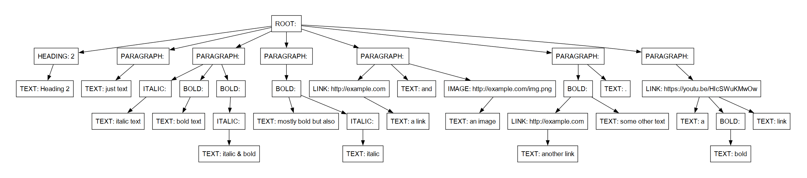

# Parser & Building an Abstract Syntax Tree

### Course: Formal Languages & Finite Automata
### Author: Cernisov Andrei, FAF-222

----

## Theory

Parsing is the process of analyzing and breaking down a sequence of tokens or symbols according to a set of rules defined by a formal grammar. It is a fundamental step in compilers, interpreters, and other language processing systems. The goal of parsing is to determine the syntactic structure of the input text and build a data structure that represents this structure, such as a parse tree or an abstract syntax tree.

A parse tree is a hierarchical representation of the syntactic structure of the input text, where each node in the tree corresponds to a rule in the grammar. While parse trees are useful for visualizing the structure of the input, they often contain redundant or unnecessary information for further processing stages, such as code generation or optimization

An Abstract Syntax Tree (AST) is a more condensed representation of the syntactic structure, where nodes represent the essential constructs of the language, and redundant information is omitted. ASTs are commonly used in compilers, interpreters, and other language processing tools because they provide a more direct representation of the program's structure, making it easier to perform subsequent operations such as type checking, code generation, or optimization

ASTs are typically built by a parser, which analyzes the input text and constructs the tree based on the grammar rules. The parser uses a set of rules or algorithms to determine the correct interpretation of the input and construct the corresponding AST nodes. Once the AST is built, it can be traversed or manipulated by other components of the language processing system to perform various tasks, such as code generation, optimization, or static analysis.

## Objectives

1. Understand the concept of parsing and its role in language processing.
2. Implement a lexical analyzer (lexer) to tokenize the input text based on regular expressions
3. Define a set of token types to categorize the tokens produced by the lexer.
4. Design and implement the necessary data structures to represent an Abstract Syntax Tree (AST).
5. Develop a parser that can construct an AST from the input text based on a set of predefined rules
6. Visualize the constructed AST using a graphical representation


## Implementation Description

The implementation consists of several components: a lexer, a set of token types, an AST node structure, and a parser

The `TokenKind` class acts as an enumeration for the various types of tokens that can be recognized in the Markdown text. Each token type corresponds to a distinct element of the Markdown syntax, such as headers, links, bold text, etc. Here's a simplified view of the `TokenKind` structure:

```python
class TokenKind:
    TEXT = 'TEXT'
    HASH = 'HASH'
    ...
    WHITESPACE = 'WHITESPACE'
    OTHER = 'OTHER'
```

By defining these token types, we categorize the textual elements, allowing the parser to apply different rules depending on the token type encountered


The `TOKEN_PATTERNS` list is crucial for the lexer's operation. It consists of tuples pairing `TokenKind` values with regular expressions that match the corresponding Markdown syntax. The list allows the lexer to determine the type of token present at the current reading position in the input text:

```python
TOKEN_PATTERNS = [
    (TokenKind.LINK, re.compile(r'\[([^\]]+)\]\(([^\)]+)\)')),
    (TokenKind.IMAGE, re.compile(r'!\[([^\]]+)\]\(([^\)]+)\)')),
    ...
]
```

Patterns are evaluated in sequence, ensuring that specific types like links and images are identified before general symbols such as brackets, which could also be part of a link or image syntax.

### Token Class

Each instance of the `Token` class represents an individual token identified in the input text. This class captures the type of the token, the text it contains, and its position in the original input, which aids in detailed error reporting and debugging:

```python
class Token:
    def __init__(self, kind, value, position):
        self.kind = kind
        self.value = value
        self.position = position

    def __str__(self):
        return f"{self.kind} {self.value if len(self.value) > 1 else str()}"
```

### Lexer Function

The `lexer` function is pivotal in transforming the input Markdown text into a sequence of tokens. This function iterates over the text, applying regular expressions from `TOKEN_PATTERNS` to identify tokens. Here's how the lexer is structured:

#### Initialization and Setup

Before scanning the text, the lexer initializes an empty list for tokens and sets the starting position to zero:

```python
def lexer(input_text):
    tokens = []
    position = 0
    skip_types = {TokenKind.WHITESPACE} 
```

#### Token Identification Loop

The main part of the lexer is a loop that continues until the end of the text is reached. In each iteration, the lexer tries to match the text at the current position against the defined patterns:

```python
while position < len(input_text):
    match = None
    for kind, pattern in TOKEN_PATTERNS:
        match = pattern.match(input_text[position:])
        if match:
            break
```

#### Token Creation

Once a match is found, a new token is created. Special handling is applied for links and images to capture their textual content and URL separately:

```python
if match:
    value = match.group(0)
    if kind in [TokenKind.LINK, TokenKind.IMAGE]:
        value = match.groups()
    if kind not in skip_types:
        tokens.append(Token(kind, value, position))
    position += len(match.group(0))
```

#### Handling Non-Matching Characters

If no pattern matches the current segment of text, the character is classified as `TokenKind.OTHER`, which helps in identifying syntax errors or unsupported characters:

```python
if not match:
    tokens.append(Token(TokenKind.OTHER, input_text[position], position))
    print("Can't match token to any pattern")
    position += 1
```


### Node Class

The `Node` class is designed to represent individual elements of the AST. Each node in the tree can represent different types of Markdown elements, such as paragraphs, headings, links, and images. The class is structured as follows:

```python
class Node:
    def __init__(self, node_type, node_value, input_tokens: List[Token], children=None):
        if children is None:
            children = []
        self.node_type = node_type
        self.node_value = node_value
        self.children = children
        self.tokens = input_tokens
        ...
```

The constructor initializes the node with a type, a value, a list of tokens that the node encompasses, and optionally, a list of child nodes. This structure allows the parser to build a tree where each node can contain other nodes.
### Processing Paragraphs and Headings

The `__process_paragraphs__` method is used to separate tokens into different paragraphs or headings based on newline tokens and the presence of hash symbols at the beginning of a line:

```python
def __process_paragraphs__(self):
    paragraph_contents = []
    for token in self.tokens:
        if token.kind == TokenKind.NEWLINE and len(paragraph_contents) > 0:
            if paragraph_contents[0].kind == TokenKind.HASH:
                node_value = len(paragraph_contents[0].value)
                paragraph_contents.pop(0)
                self.children.append(Node(NodeType.HEADING, node_value, paragraph_contents))
            else:
                self.children.append(Node(NodeType.PARAGRAPH, None, paragraph_contents))
            paragraph_contents = []
        ...
```

This method groups tokens into paragraphs or headings, using newline tokens as delimiters. If a paragraph starts with a hash symbol, it is classified as a heading, and its level is determined by the number of hash symbols.

### Processing Paragraph Contents

The `__process_paragraph_contents__` method handles the detailed content within paragraphs, such as detecting and forming bold, italic, or link nodes based on specific token patterns:

Before processing the tokens, we initialize several local variables to manage the state as we iterate through the tokens:

```python
def __process_paragraph_contents__(self):
    emphasized_contents = []  
    star_number = 0  
```

`emphasized_contents` collects tokens that are inside an emphasis (italic or bold) block, while `star_number` keeps track of the number of asterisks that opened the current emphasis block, which determines whether the text is bold, italic, or both.

#### Token Iteration and Emphasis Detection

We iterate over each token to determine its type and handle it accordingly. The primary check at this stage is whether the token is a star, indicating potential emphasis:

```python
for token in self.tokens:
    if token.kind == TokenKind.STAR:
        if star_number == 0:  
            star_number = len(token.value)  
            continue  
```

If the current token is an asterisk and no emphasis block is open (`star_number == 0`), we record the number of asterisks. This setup helps handle nested emphasis by tracking when a new emphasis starts.

#### Handling Non-Star Tokens within Emphasis

For tokens that are not stars or when inside an emphasis block, we add them to the `emphasized_contents` list, unless they close an emphasis block:

```python
    else:
        if token.kind != TokenKind.STAR or len(token.value) != star_number:
            emphasized_contents.append(token)  
```

Tokens that are not stars or do not match the opening star count continue to be collected as part of the emphasized content.

#### Closing an Emphasis Block

When we encounter a star token that matches the count of the opening stars, it signifies the end of the current emphasis block. Depending on the number of stars (`star_number`), we create different types of emphasis nodes:

```python
    if token.kind == TokenKind.STAR and len(token.value) == star_number:  # if it's a closing star
        if star_number == 1:
            self.children.append(Node(NodeType.ITALIC, None, emphasized_contents))
        elif star_number == 2:
            self.children.append(Node(NodeType.BOLD, None, emphasized_contents))
        elif star_number == 3:
            new_node = Node(NodeType.ITALIC, None, emphasized_contents)
            self.children.append(Node(NodeType.BOLD, None, [], children=[new_node]))
        emphasized_contents = []  
        star_number = 0  
```

For one star, we create an italic node, and for two stars, a bold node. The content collected in `emphasized_contents` is passed to these nodes. After creating the node, we reset `emphasized_contents` and `star_number` to handle any subsequent emphasis correctly.

#### Handling Non-Emphasis Tokens

If a token doesn't start or end an emphasis and isn't part of an emphasized block, we need to handle it as regular text or other elements like links or images:

```python
        if star_number == 0: 
            if token.kind == TokenKind.TEXT:
                self.children.append(Node(NodeType.TEXT, token.value, []))
            elif token.kind == TokenKind.LINK:
                link_content_tokens = lexer(token.value[0])  
                self.children.append(Node(NodeType.LINK, token.value[1], link_content_tokens))
            elif token.kind == TokenKind.IMAGE:
                alttext_content_tokens = lexer(token.value[0])  
                self.children.append(Node(NodeType.IMAGE, token.value[1], alttext_content_tokens))
```

Regular text tokens are directly appended as `TEXT` nodes. Links and images require further tokenization of their descriptive parts, which are handled recursively with the lexer to generate appropriate child nodes.


### Visualizing the AST

Finally, the `Node` class includes a method for visualizing the AST using the Graphviz library:

```python
def visualize(self, graph=None, parent=None):
    if graph is None:
        graph = Digraph(node_attr={'shape': 'rectangle', 'fontname': 'Arial'})
    node_label = f"{self.node_type}: {self.node_value if self.node_value else ''}"
    node_id = str(id(self))
    graph.node(node_id, label=node_label)
    if parent:
        graph.edge(parent, node_id)
    for child in self.children:
        child.visualize(graph, node_id)
    return graph
```

This method creates a visual representation of the AST, with each node labeled according to its type and value. 

## Results
Here's an example input:
```
## Heading 2
just text
*italic text* **bold text** ***italic & bold***
**mostly bold but also *italic* **
[a link](http://example.com) and 
**[another link](http://example.com) some other text**.
[a **bold** link](https://youtu.be/HIcSWuKMwOw)
```
This is what the output looks like:

```
ROOT 
  HEADING 2
    TEXT Heading 2
  PARAGRAPH 
    TEXT just text
  PARAGRAPH 
    ITALIC 
      TEXT italic text
    BOLD 
      TEXT bold text
    BOLD 
      ITALIC 
        TEXT italic & bold
  PARAGRAPH 
    BOLD 
      TEXT mostly bold but also
      ITALIC 
        TEXT italic
  PARAGRAPH 
    LINK http://example.com
      TEXT a link
    TEXT and
    IMAGE http://example.com/img.png
      TEXT an image
  PARAGRAPH 
    BOLD 
      LINK http://example.com
        TEXT another link
      TEXT some other text
    TEXT .
  PARAGRAPH 
    LINK https://youtu.be/HIcSWuKMwOw
      TEXT a
      BOLD 
        TEXT bold
      TEXT link
```
There's also a graphical representation:


## Conclusion

This implementation demonstrates a basic parser and AST construction for a subset of Markdown syntax. The lexer identifies and tokenizes the input text based on regular expressions, and the parser builds the AST by analyzing the token sequences and creating corresponding nodes

AST provides hierarchical representation of the input, making it easier to perform further processing. Visualized output helps understand the structure of the AST and how the different elements of the input text are organized.

While this implementation covers a limited set of Markdown syntax elements, it could serve as a starting point for building more comprehensive parsers and language processing tools